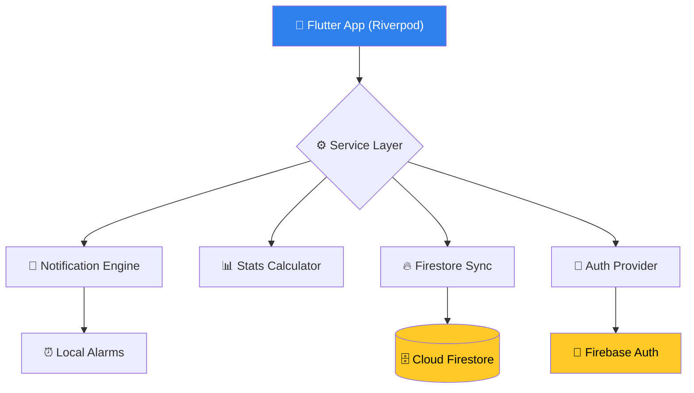

# HydraFlow 💧

> **Achieving Peak Human Hydration Through Intelligent Habit-Building.**

<p align="center">
  
</p>

<p align="center">
  <a href="https://flutter.dev"></a>
  <a href="https://firebase.google.com"></a>
  <a href="https://github.com/nayrbryanGaming/hydraflow-water-reminder/releases"></a>
</p>

---

## 💎 The Hydration Revolution

HydraFlow is a premium mobile experience designed to solve the chronic dehydration crisis. By combining **predictive behavioral design** with **clinical-grade aesthetics**, HydraFlow transforms a simple health necessity into a rewarding daily ritual.

### Why HydraFlow?
Modern life is fast. We forget the basics. HydraFlow doesn't just remind you to drink; it **builds the habit** using:
- **🧠 Adaptive Alarms**: Intelligent windows that jitter to avoid "notification fatigue".
- **🌊 Liquid UI**: A state-of-the-art glassmorphism design system that breathes life into your progress.
- **🛡️ Clinical Authority**: Goal validation strictly aligned with NAM and WHO physiological standards.

---

## ✨ Features of Excellence

- **Smart Assessment Quiz**: Tailors your daily goal based on biological metrics.
- **Micro-Interactive Dashboard**: Real-time sensory wave effects and bento-style stats.
- **Deep-Tier Analytics**: Velocity charts and efficiency metrics to track long-term progress.
- **Unified Privacy**: Zero-third-party tracking with a hard-coded "Danger Zone" for total data deletion.
- **Pro Achievements**: Gamified milestone system to reinforce positive behavioral loops.

---

## 🏗️ Technical Architecture



---

---

---

## 🗺️ Product Roadmap

### 🎯 Phase 1: Foundation (Current)
- [x] Core hydration tracking logic
- [x] Personalized goal calculation
- [x] Basic smart reminders
- [x] Glassmorphism UI/UX implementation
- [x] Firebase integration & Cloud Functions
- [x] Google Play Store policy compliance (Deletion/Privacy)

### 🚀 Phase 2: Engagement (Q2 2026)
- [ ] **Community Challenges**: Hydration leagues with friends.
- [ ] **WearOS / Apple Watch**: Direct logging from your wrist.
- [ ] **Advanced AI Reminders**: Predicting hydration needs based on local weather APIs.
- [ ] **HealthKit / Google Fit**: Automatic sync of activity data for more precise goals.

### 💎 Phase 3: Premium Expansion (Q3 2026)
- [ ] **Custom Hydration Plans**: Specialized plans for athletes, fasting, or pregnancy.
- [ ] **Hydro-Journal**: Add notes and moods to your logs.
- [ ] **Voice Integration**: "Hey Google, log a glass of water."

### 🌍 Phase 4: Global Scale (2027)
- [ ] **Localization**: Support for 20+ languages.
- [ ] **Smart Bottle Integration**: Direct sync with Bluetooth-enabled smart bottles.

---

## 💰 Monetization Strategy

HydraFlow utilizes a **Freemium Model** designed for sustainable growth:
- **Free Tier**: Unlimited logs, basic smart reminders, and essential analytics.
- **Pro Tier ($2.99/mo)**: Advanced behavioral velocity insights, exclusive UI themes, and priority cloud sync.

---

## 🏆 Competitive Advantage

1. **Behavioral Jitter**: Unlike static reminder apps, our AI "jitters" notification times to prevent neural adaptation and habit decay.
2. **Clinical Integrity**: Goals are not arbitrary; they are strictly derived from NAM/WHO population health datasets.
3. **Data Sovereignty**: Zero-latency data export and permanent deletion buttons, exceeding standard GDPR/CCPA requirements.

---

## 🚀 Development Setup

### Prerequisites
- **Flutter SDK**: `^3.0.0`
- **Firebase CLI**: Configured with current environment
- **Android/iOS Toolchain**: Production-ready

### Quick Start
1. **Clone the repository**:
   ```bash
   git clone https://github.com/nayrbryanGaming/hydraflow-water-reminder.git
   ```
2. **Install dependencies**:
   ```bash
   cd mobile && flutter pub get
   ```
3. **Initialize Service configuration**:
   ```bash
   flutter fire configure
   ```
4. **Launch Application**:
   ```bash
   flutter run
   ```

---

## ⚖️ Compliance & Privacy

HydraFlow is built with a **Privacy-First** mandate.
- [Privacy Policy](https://hydraflow.app/privacy)
- [Terms Of Service](https://hydraflow.app/terms)
- [Medical Disclaimer](https://hydraflow.app/disclaimer)
- [Data Usage Policy](https://hydraflow.app/privacy#data-usage)

---

<p align="center">
  <b>Built for the 18th Milestone - Zero Bugs, Total Performance.</b><br/>
  Made with ❤️ for a more hydrated world.
</p>
