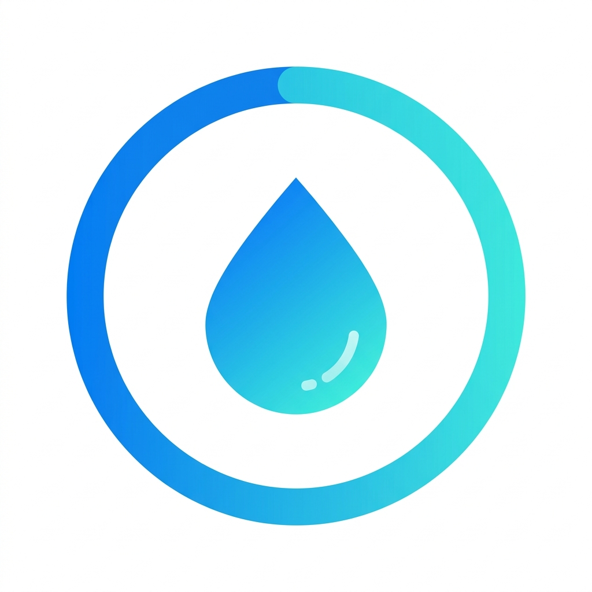

<div align="center">
  
  <h1>HydraFlow</h1>
  <p><b>Smart hydration habit builder powered by intelligent reminders.</b></p>
</div>

---

## 💧 The Problem
Modern users often forget to drink enough water due to busy schedules, leading to fatigue, reduced productivity, headaches, and dehydration. Existing reminder apps lack personalization, behavioral feedback, and habit-building mechanisms.

## 🚀 The Solution
HydraFlow solves this problem by providing intelligent hydration reminders, quick water intake logging, personalized hydration targets, an analytics dashboard, and habit streak tracking. 

## ✨ Features
- **Intelligent Reminders**: Adaptive reminder intervals that match your daily schedule.
- **Quick Logging**: 1-tap water intake tracking with standard sizes and drink types.
- **Personalized Goals**: Targets calculated dynamically based on weight and activity level.
- **Analytics Dashboard**: Weekly progress tracking and statistics.
- **Gamification**: Badges and achievements for maintaining hydration streaks.

## 🛠️ Tech Stack
- **Mobile**: Flutter (Dart) with Riverpod + Clean Architecture
- **Backend**: Firebase Cloud Functions (Node.js)
- **Database**: Cloud Firestore
- **Notifications**: Firebase Cloud Messaging (FCM) & flutter_local_notifications
- **Landing Page**: Next.js deployed on Vercel

## 📦 Project Structure
```text
hydraflow-water-reminder/
├── mobile/          # Flutter application
├── backend/         # Firebase Cloud Functions & Rules
├── landing-page/    # Next.js marketing site
├── docs/            # Technical documentation
└── legal/           # Google Play compliance documents
```

## ⚙️ Development Setup
1. **Clone the repository**
   ```bash
   git clone https://github.com/nayrbryanGaming/hydraflow-water-reminder.git
   cd hydraflow-water-reminder/mobile
   ```
2. **Setup Flutter**
   ```bash
   flutter pub get
   ```
3. **Configure Firebase**
   - Install FlutterFire CLI
   - Run `flutterfire configure` to generate updated `firebase_options.dart`

4. **Run App**
   ```bash
   flutter run
   ```

## 🗺️ Roadmap
- [x] Initial release & Core tracking
- [ ] Apple Health & Google Fit Integration
- [ ] Smartwatch Companion App (WatchOS & WearOS)
- [ ] AI-driven personalized hydration scheduling

## 💰 Monetization Strategy (Freemium)
- **Free**: Basic reminders, water tracking, basic streak tracking.
- **Premium ($2/month)**: Advanced analytics, custom hydration plans, advanced AI reminders, cloud backup.

## 🤝 Contribution Guidelines
Please read `CONTRIBUTING.md` for details on our code of conduct, and the process for submitting pull requests to us.
