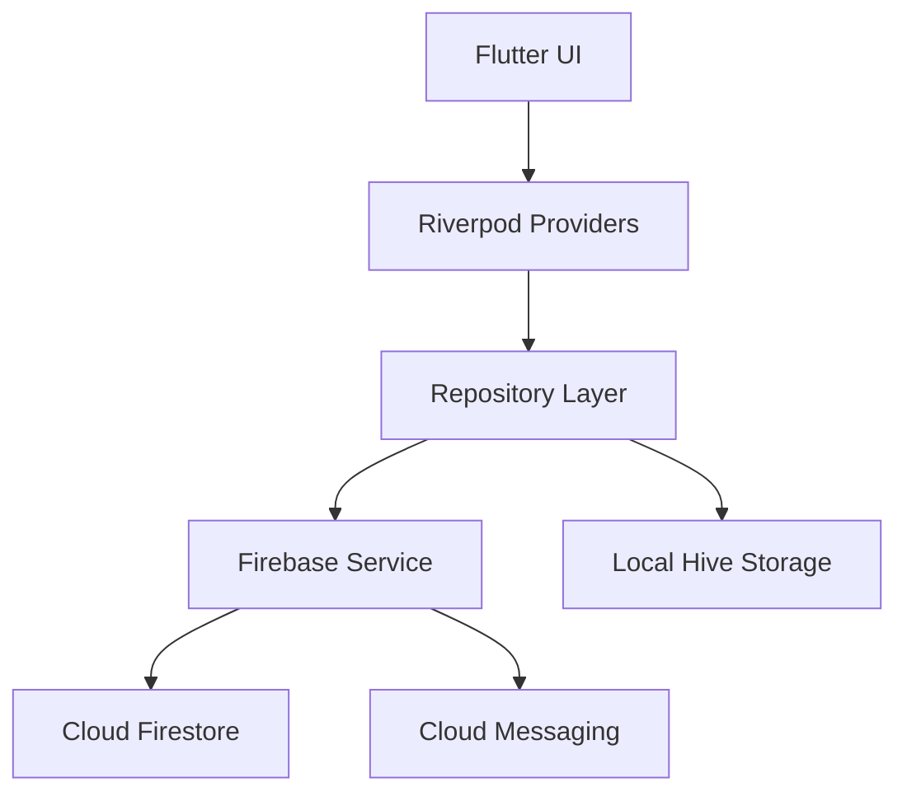

# HydraFlow 💧

> **Smart hydration habit builder powered by intelligent reminders.**

[](https://flutter.dev)
[](https://firebase.google.com)
[](LICENSE)

HydraFlow is a premium mobile application designed to transform hydration from a chore into a seamless habit. Built with Flutter and Firebase, it leverages behavioral design to help users stay focused, energized, and healthy.

---

## 🚀 Problem & Solution

### The Problem
Modern professionals and students often neglect hydration due to deep work states or busy schedules. This leads to:
- Reduced cognitive function & focus
- Fatigue and headaches
- Long-term metabolic health issues

### The Solution
HydraFlow solves this through:
- **Intelligent Reminders**: Adaptive intervals that learn from your logging habits.
- **Biometric Calibration**: Personalized hydration targets based on weight and activity.
- **Behavioral Feedback**: Gamified streaks and achievements to reinforce the habit loop.

---

## ✨ Core Features

- 🌊 **Dynamic Wave UI**: Visual progress tracking with interactive liquid physics.
- 🎯 **Smart Goal Setting**: Automatic calculation of daily intake targets.
- 🔔 **Intelligent Notifications**: Non-intrusive, smart reminder engine.
- 📊 **Advanced Analytics**: Detailed insights into daily, weekly, and monthly hydration trends.
- 🏆 **Achievement System**: Unlock milestones and build your hydration streak.
- 🛡️ **Privacy First**: Google Play compliant data handling with full data sovereignty.

---

## 🛠 Tech Stack

| Component | Technology |
| :--- | :--- |
| **Mobile** | Flutter (Dart) |
| **Backend** | Firebase (Auth, Firestore, FCM) |
| **State Management** | Riverpod |
| **Local Storage** | Hive |
| **Analytics** | Firebase Analytics & Crashlytics |
| **Infrastructure** | Vercel (Landing Page) |

---

## 🏗 Architecture

HydraFlow follows a clean, feature-first architecture for maximum scalability and maintainability:



---

## 📦 Installation & Setup

### Prerequisites
- Flutter SDK (latest stable)
- Android Studio / Xcode
- Firebase Project

### Quick Start
1. **Clone the repository**
   ```bash
   git clone https://github.com/nayrbryanGaming/hydraflow-water-reminder.git
   ```
2. **Install dependencies**
   ```bash
   flutter pub get
   ```
3. **Setup Firebase**
   - Place your `google-services.json` in `android/app/`
   - Place your `GoogleService-Info.plist` in `ios/Runner/`
4. **Run the app**
   ```bash
   flutter run
   ```

---

## 🗺 Roadmap

- [x] v1.0: Core tracking & reminders
- [x] v1.1: Advanced analytics & achievements
- [ ] v1.2: WearOS & Apple Watch integration
- [ ] v2.0: AI-powered hydration forecasting

---

## 💰 Monetization Strategy

**Freemium Model:**
- **Free**: Basic reminders, manual tracking, 7-day history.
- **Premium ($2/month)**: Adaptive AI reminders, custom hydration plans, unlimited history, and exclusive UI themes.

---

## ⚖️ Legal & Compliance

HydraFlow is fully compliant with Google Play Store policies:
- [Privacy Policy](legal/privacy_policy.md)
- [Terms of Service](legal/terms_of_service.md)
- [Data Usage Policy](legal/data_usage_policy.md)

---

## 🤝 Contribution Guide

We welcome contributions! Please see our [Contributing Guide](CONTRIBUTING.md) for details on our code of conduct and the process for submitting pull requests.

---

&copy; 2026 HydraFlow Team. Built with ❤️ for a healthier world.
